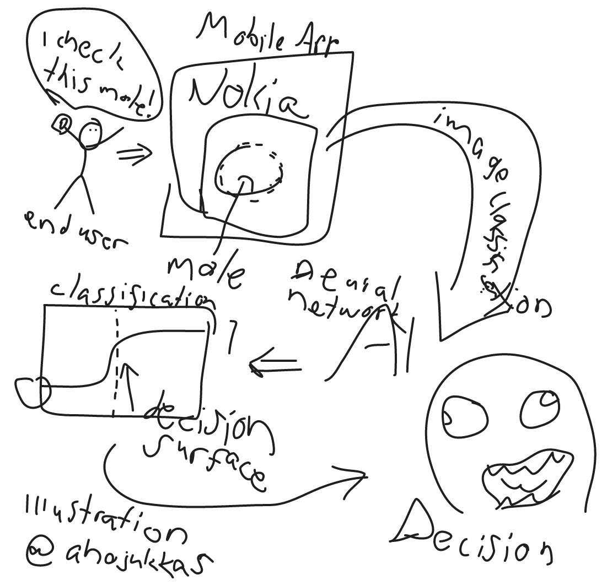

# Detecting skin problems by using smart device and deep neural networks

Final project for the Building AI course

## Summary

The project aims to produce a mobile application that can use an image sample to
identify whether it is a benign tumor or perhaps something that should be a
concern, such as an incipient melanoma tumor. The application uses convolutional
neural networks and deep learning to classify samples.

## Background

The findings show that people are not very enthusiastic about going to the
doctor even in cases where there might be some good reasons.

On the other hand, melanoma is a rapidly growing type of cancer, especially in
young people. The first diagnosis is made by a doctor by examining the skin
visually. It would make it easier to apply for treatment in time if
pre-screening could be done easily with a mobile app.

The key motivation is, on the one hand, to reduce the urgency of doctors and, on
the other hand, to strive to improve public health and improve access to
treatment in a timely manner.

The topic is very important as skin cancers are a fast growing type of cancer
and on the other hand, image recognition is advanced and the technology is
mature for this application.

## How is it used?

Using the application is simple. The user can use the program by taking a photo
of the mole they suspect. After that the AI gives a preliminary assessment of
the harmfulness of the mole using an image classifier. The intention is that the
use of the program does not require any other technology than a smartphone in
order to maximize the potential user base. Workflow is described in the image
below.

## Data sources and AI methods

AI is trained by image data found from public databases, like

- The Danish Melanoma Database [(1)][1]
- National Melanoma Database [(2)][2]
- Melanoma Research Database (MRD2) [(3)][3]

[1]: https://www.ncbi.nlm.nih.gov/pmc/articles/PMC5094525/
[2]: https://melanomafocus.com/activities/database-project/
[3]: https://www.melanoma.org.au/research/research-resources/melanoma-research-database-mrd2/

## Challenges

At best, the program provides only a rough estimate of potential health
problems. It is always the responsibility of the user to seek medical advice if
there is a reason to do so. Users need to understand that artificial
intelligence is not capable of making a diagnosis similar to that made by
medical experts, and that medical research is worth going for.

The application sends information related to human health to artificial
intelligence. There are clearly privacy risks involved that need to be properly
addressed.

False negative results are particularly problematic. Although the purpose of the
application is to provide people with more information about skin cancers, in
some cases the end result may be that the person is overconfident with the
results of the application and therefore does not seek medical examination, even
if it is appropriate to do so. At worst, a program can turn against its purpose
and cause unnecessary human deaths.

Thus, the idea of an application may not even be feasible in the end. We are
facing a very big ethical issue. Can false negatives be allowed, that is, that
people die because they are overconfident in artificial intelligence and not
seek treatment at all, if in exchange many people get more years of life because
they know how to apply for treatment in time thanks to the application?

## What next?

In the next steps, the project could also be extended to the automatic
classification of other types of health-related information. For example, there
is a microphone on a cell phone that could be used as a “poor man’s stethoscope”
to pre-screen for heart and lung problems.

## Acknowledgments

Sources of inspiration: Bob Marley, who died of skin cancer at the age of 36.
